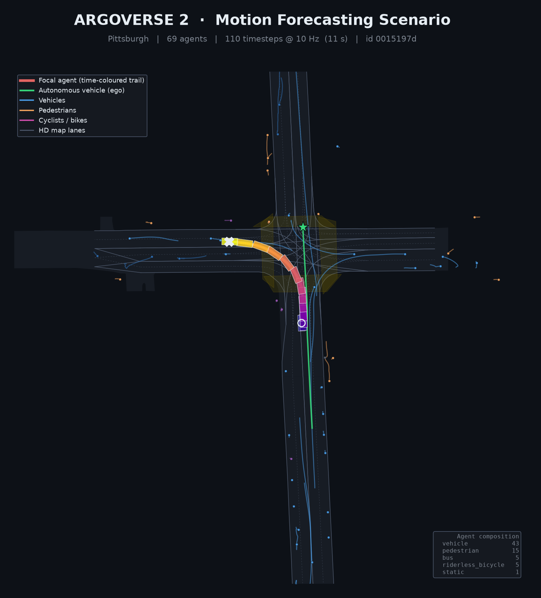

# DepthEstimationMono — SelfCalibDepth

**Metric distance and camera self-calibration from a single image, supervised by LiDAR.**

SelfCalibDepth learns to read *metric depth* from one monocular image while
**recovering the camera's intrinsics** (`fx, fy, cx, cy, distortion`) from that same
image. A synchronized LiDAR sweep, projected into the camera, is the only ground
truth: it anchors both a fine-tuned [Depth Anything V2](https://github.com/DepthAnything/Depth-Anything-V2)
backbone and a learnable camera model, which are coupled through a per-pixel **ray
map**. A wrong focal length makes back-projected depth miss the LiDAR points, and the
gradient flows back into the calibration — DroidCalib's idea, re-grounded on LiDAR.

Full design: [`FRAMEWORK.md`](FRAMEWORK.md) · paper: [`PAPER.md`](PAPER.md) /
[`PAPER.pdf`](PAPER.pdf) · distilled context: [`info_logs/`](info_logs/).


## Results

**In-domain (Argoverse 2, held-out cameras):** focal length recovered to **0.26 % (fx)
/ 0.41 % (fy)**, depth **AbsRel 0.112 / δ<1.25 = 0.884**, vehicle distance ≤60 m to
**8.6 m** MAE — all from a single image.

**Cross-dataset generalization** — the AV2-trained model adapted to other benchmarks
with a **20-frame** few-shot adaptation (per-camera latent + a 58.8 k-param depth head):

| Dataset (front cam)        | Regime          | AbsRel | δ<1.25 | fx err |
|----------------------------|-----------------|--------|--------|--------|
| KITTI (fx≈721, 1242×375)   | zero-shot       | 0.390  | 0.026  | 97.1 % |
| KITTI                      | +latent+head    | **0.100** | **0.953** | 1.1 % |
| nuScenes (fx≈1266, 1600×900)| zero-shot      | 0.274  | 0.184  | 45.3 % |
| nuScenes                   | +latent+head    | **0.122** | **0.853** | 0.7 % |
| Argoverse 2 (fx≈1782)      | *in-domain*     | *0.112*| *0.884*| *0.26 %* |

The model does not transfer zero-shot (the per-camera latent is AV2-specific), but a
few frames recover focal length to ~1 % and, with a light depth-head adaptation, match
in-domain depth. See [`info_logs/05_benchmarks.md`](info_logs/05_benchmarks.md).

## Unified multi-benchmark layer

Every dataset is reduced to one contract — image + sparse LiDAR-projected metric depth
+ ground-truth intrinsics — behind a pluggable adapter, so the framework treats
**Argoverse 2 · KITTI · nuScenes · Lyft L5** identically. Adding a benchmark = adding
one adapter (`src/calib_depth/benchmarks/`).

```bash
# Same LiDAR-depth supervision overlay for ANY benchmark
python src/visualize_benchmark.py --benchmark kitti --root <kitti_raw> --cam image_02
NUSCENES_VERSION=v1.0-mini python src/visualize_benchmark.py --benchmark nuscenes --root <nuscenes>
```

## Setup

Python 3.14, no conda — a plain venv (`av2` ships cp314 wheels). On a headless box use
`opencv-python-headless`:

```bash
python3.14 -m venv --without-pip .venv          # this box lacks ensurepip
.venv/bin/python <(curl -s https://bootstrap.pypa.io/get-pip.py)
.venv/bin/pip install -r requirements.txt
```

GPU training/inference (PyTorch + Depth Anything V2) runs on a remote RTX 5090; the
geometry/data code runs anywhere.

## Usage

```bash
# Ground-truth signal: project a LiDAR sweep into a ring camera (AV2)
python src/lidar_depth.py --log-dir data/sensor-sample/val/<log_id> --cam ring_front_center --out viz

# Train / evaluate on any benchmark (default av2)
python -m calib_depth.train --benchmark av2   --data-root data/sensor --epochs 3
python -m calib_depth.eval  --benchmark kitti --data-root <kitti_raw> --cam image_02 --ckpt <ckpt>

# Few-shot cross-dataset adaptation (calibration + depth head)
python -m calib_depth.adapt_latent --benchmark nuscenes --ckpt <av2_ckpt> \
    --data-root <nuscenes> --cam CAM_FRONT --adapt-head --no-aspect-prior

# Single-image inference: depth + estimated intrinsics + per-vehicle distance
python -m calib_depth.infer --ckpt <ckpt> --log-dir data/sensor/val/<id> --cam ring_front_center

# Paper figures
python -m calib_depth.figures            # qualitative cross-dataset panel (GPU)
python src/make_results_bars.py          # quantitative results bars (no GPU)
```

## Argoverse 2 Motion-Forecasting visualizer

A secondary component: renders the AV2 MF dataset on the official `av2` API (hero
figures + animated GIFs), plus a from-scratch format reference in
[`FORMAT.md`](FORMAT.md).

```bash
python src/visualize_av2.py --data-root data/motion-forecasting --out viz --gif
```



## Layout

```
src/calib_depth/        # SelfCalibDepth: model, losses, camera_model, ray_map,
                        #   dataset, train, eval, infer, adapt_latent, figures
src/calib_depth/benchmarks/   # unified adapters: av2, kitti, nuscenes, lyft + registry
src/visualize_benchmark.py    # cross-dataset LiDAR-depth overlay
src/lidar_depth.py            # LiDAR -> camera projection (the GT depth signal)
src/visualize_av2.py          # motion-forecasting hero figures + animation
src/make_*.py                 # PDF/DOCX/diagram/results-bar builders
FRAMEWORK.md · PAPER.*        # design + paper
info/ · info_logs/            # dated run journals + distilled context
viz/ · viz_v3/ · viz_bench/ · viz_paper/   # figures
```

Large/regenerable artifacts (`.venv/`, `data/`, `checkpoints*/`, caches) are
git-ignored; the download/train scripts recreate them.
